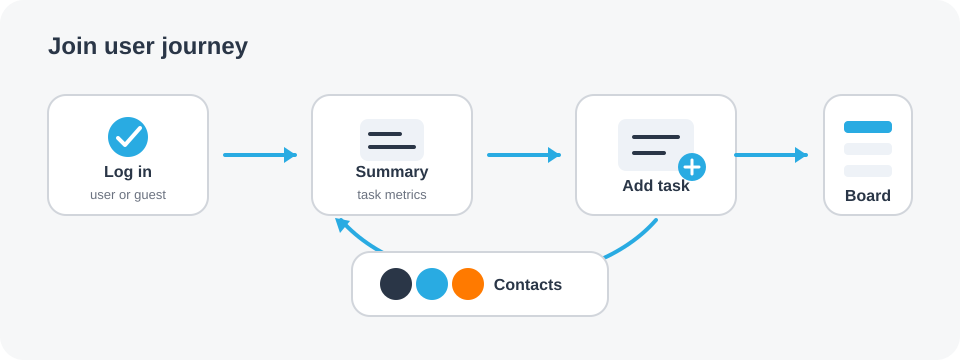
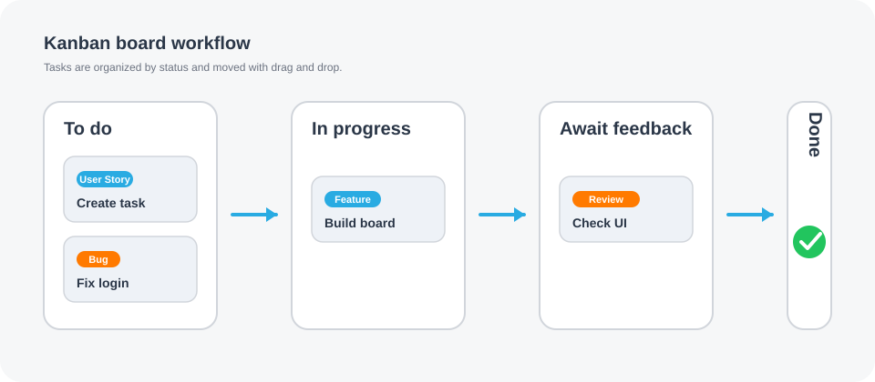
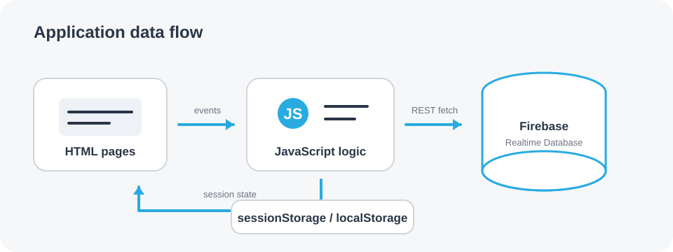

# Join – Kanban Task Manager

Join is a browser-based task management app inspired by Kanban workflows. It includes user registration and login, contact management, task creation, drag-and-drop board updates, and a live summary dashboard.

## Features

- **Authentication flow**: sign up, log in, guest log in, and remembered session state.
- **Task management**: create, edit, delete, assign contacts, define priorities, due dates, and subtasks.
- **Kanban board**: tasks grouped by status (`toDo`, `inProgress`, `awaitFeedback`, `done`) with drag-and-drop movement.
- **Search & filtering behavior** on board cards.
- **Summary dashboard**: live counters for key metrics, including to-do, done, urgent, in progress, and awaiting feedback.
- **Contacts area**: create and maintain assignable contacts.

## Visual Overview

### App Flow

The app starts with authentication, then leads users into the dashboard, task creation, board management, and contact maintenance.



### Kanban Workflow

Tasks move through the board from **To do** to **In progress**, **Await feedback**, and finally **Done**.



### Data Flow

The frontend uses plain JavaScript modules, browser storage for session/UI state, and Firebase Realtime Database requests through `fetch`.



## Tech Stack

- **Frontend**: HTML, CSS, vanilla JavaScript (no framework/build step).
- **Backend**: Firebase Realtime Database (REST API via `fetch`).
- **State storage**: `sessionStorage` and `localStorage` for UI/session behavior.

## Project Structure

```text
.
├── index.html                # Login entry page
├── summary.html              # Dashboard
├── board.html                # Kanban board
├── add_task.html             # Task creation flow
├── contacts.html             # Contact management
├── script/                   # Application logic (auth, board, summary, contacts, Firebase access)
├── style/                    # Page and component styles
├── assets/                   # Icons, images, fonts
└── docs/images/              # README visuals
```

## Run Locally

Because this is a static frontend app, run it through a local web server:

```bash
# from repository root
python3 -m http.server 8000
```

Then open `http://localhost:8000`.

## Configuration

Firebase base URL is defined in:

- `script/firebase.js` → `BASE_URL`

If you want to connect your own backend instance, update this value to your Firebase Realtime Database URL.

## Notes for Contributors

- Keep the app framework-free (vanilla JS + static assets).
- Prefer small, page-focused modules under `script/` and `style/`.
- Validate user-facing form inputs and preserve current UI behavior patterns.
